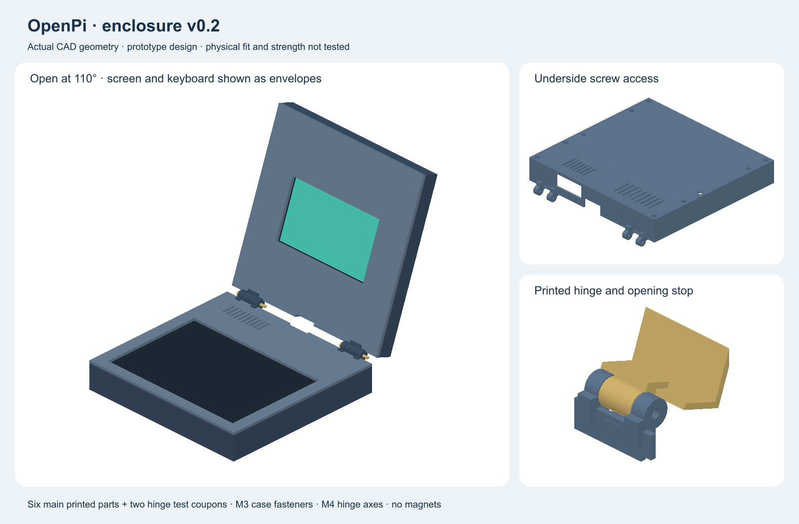

# OpenPi enclosure — current version 0.2

The current prototype includes six printed parts, integral hinges with M4 axes, 110-degree stops, underside keyboard rails, nut pockets, Pi mounting holes, ventilation and service openings.

- [Open assembly in FreeCAD](v0.2/openpi-assembly.FCStd)
- [Assembly STEP](v0.2/openpi-assembly.step)
- [Individual editable parts](v0.2/openpi-parts.FCStd)
- [Individual parts STEP](v0.2/openpi-parts.step)
- [STL folder](v0.2/STL)
- [Exact fasteners and assembly sequence](v0.2/ASSEMBLY.md)
- [Geometry checks](v0.2/checks.json)

**Start with the two hinge coupons.** Nominal geometry and STL closure have been checked. Physical keyboard/display fit, printing tolerances, hinge strength and cable routing still require tests. No physical prototype has been built. The current main body is 262 × 250 mm; the deepest part including hinge tabs is 266 mm. Read the assembly guide before slicing.

## Archived v0.1 layout notes

Everything below describes the earlier layout study, retained for design history. Use v0.2 above for the current enclosure. Old dimensions and statements about missing STL files below apply only to v0.1.

**Space-planning model only — not production-ready or a verified fit.**

Open `openpi-layout.FCStd` in FreeCAD to inspect named component envelopes. `openpi-layout.step` is a neutral exchange file. `build_layout.py` is the editable source used to generate both, with FreeCAD 1.1.1. Dimensions are in millimetres.

## Layout parameters

| Envelope | Width × depth × height |
|---|---|
| Base | 250 × 250 × 42 |
| Lid, shown flat beside base | 250 × 250 × 22 |
| Intact keyboard, provisional maximum height | 230 × 160 × 26 |
| Pi board footprint reserve | 85 × 58 |
| Pi assembly height reserve | 30, provisional |
| Display module, landscape planning reserve | 189.32 × 120.24 × 16, depth provisional |

The keyboard is at the front. The Pi and cable reserve occupy the rear. All electronics are represented by bounding boxes, not detailed manufacturer models. A box fitting does not prove ports, plugs, or cables fit.

The keyboard is retained between a top housing lip and padded internal supports. Screws are accessed vertically from below. They must engage case retainers, not penetrate the keyboard. The current CAD does not model this final clamp stack.

The lid is displayed **flat beside the base** for inspection, not in the assembled hinged position. This view must not be interpreted as a working hinge mechanism.

## Still required before full-case printing or funding-ready CAD

- Resolve exact keyboard variant and conflicting published heights; confirm border areas available for clamping and route the full factory cable.
- Model the upper deck, retaining lips, clamp rails, pads, captive nuts, bottom access holes, and tightening stops. Check screwdriver access and screw engagement.
- Locate Pi/display fixing holes from official drawings and verify mounting depth.
- Choose real hinge hardware and design mounts, opening stops, and closed-lid clearance.
- Design connector openings and verify insertion/removal space for every plug.
- Finish cooling vents, feet, display bezel, and power-button access.
- Check the display ribbon path and strain relief throughout the hinge range. Do not assume a static ribbon is rated for repeated bending.
- Print fit coupons and revise tolerances; validate final slice on QIDI Q2.

No STL release is provided because this model is not yet suitable for fabrication. The STEP file is explicitly a layout study, not a completed manufacturing design.
