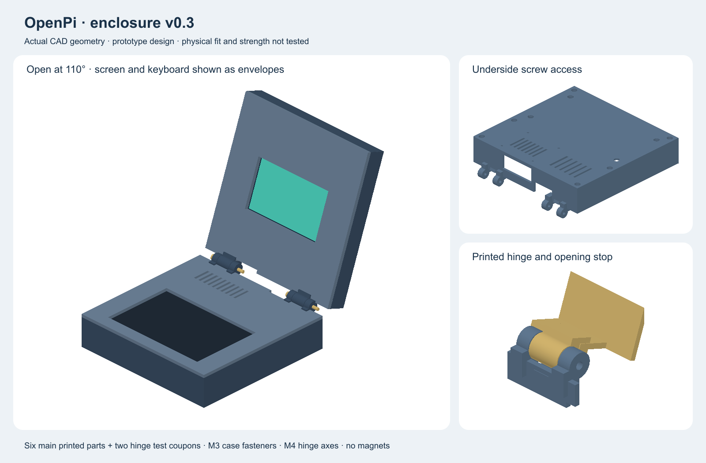
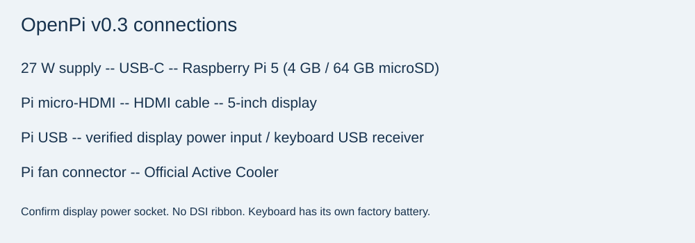

# OpenPi Laptop — v0.3 budget prototype

A Raspberry Pi 5 **4 GB** mini laptop with **64 GB microSD**, a **5-inch HDMI display**, a small wireless keyboard with touchpad, and a custom PETG case. The keyboard is retained with screws accessed from underneath. No magnets. The computer uses wall power; only the intact purchased keyboard has its own factory battery.

**Planning total: EUR 250.00 including allowances for delivery and small parts. This is not a confirmed shopping-cart total. Funding, component fit, display touch input and physical tests are not approved or proven.** See the remaining purchasing checks before submitting or ordering.

The image is rendered from the CAD. Screen and keyboard are simplified reference boxes, not exact product surfaces. The earlier appearance concept and v0.2 assets are historical and are not the current shopping design.

[Stardance project](https://stardance.hackclub.com/projects/61671) · [BOM.csv](BOM.csv) · [Download project ZIP](OpenPi-project-files.zip) · [CAD folder](CAD/v0.3) · [Budget evidence](docs/budget.md)

## What changed to reduce cost

- Keep the requested Pi 5 4 GB, 64 GB storage, proper 27 W power supply and Active Cooler.
- Replace the 7-inch DSI display with the 5-inch HDMI panel, Elecom code 17259. Use the keyboard touchpad; Pi 5 touch drivers are not validated.
- Replace the Perixx keyboard with the small PROLECH/BLOW KS-6 candidate, Pabex code 84-256-. Verify the exact variant and package before ordering.
- Shrink the main case body from 262 × 250 mm to **196 × 190 mm** and resize the keyboard opening, rails, display cradle and bezel. Keep underside screws and printed friction hinges.
- Budget a light-green PETG spool rather than requiring charcoal. Render colors are illustrative.

## Funding and the complete budget

- Target request: **S tier, USD 200 maximum**, subject to reviewer approval.
- Total spending ceiling: **EUR 250**, including delivery, VAT and payment charges.
- At the previously recorded reference rate of EUR 1 = USD 1.1592, USD 200 is approximately EUR 172.53. The expected contribution is approximately **EUR 77.47**, not EUR 50. The builder accepted the EUR 250 plan after this difference was explained.
- These conversion figures are illustrative, not a live grant-card conversion quote. Confirm the actual usable grant and personal contribution before ordering. A lower grant does not authorize a larger personal contribution automatically.
- No grant request or purchase has been submitted by this revision.

## Itemized estimate

| Part | EUR | Evidence |
|---|---:|---|
| Raspberry Pi 5 | 129.90 | Observed retailer price |
| Elecom HDMI LCD code 17259 | 29.99 | Live browser price; 9 in stock |
| PROLECH / BLOW mini KS-6; code 84-256- | 7.39 | Live browser sale price; in stock |
| Goodram M1AA 64 GB | 16.39 | Live browser price; delivery up to 7 days |
| Official Raspberry Pi 27 W USB-C supply | 12.95 | Observed retailer price |
| Official Raspberry Pi 5 Active Cooler | 6.50 | Live browser price; in stock |
| 3DPower Basic PETG Light Green | 13.90 | Search listing reference; live verification pending |
| Enclosure v0.3 fastener set | 10.00 | Unverified purchasing allowance |
| Integral printed hinges | 0.00 | Included elsewhere |
| Display cables | 6.00 | Unverified purchasing allowance |
| Pads and feet | 1.00 | Unverified purchasing allowance |
| USB microSDXC reader | 3.00 | Unverified purchasing allowance |
| Delivery | 12.00 | Unverified combined allowance |
| Reserve | 0.98 | Planning reserve |
| **Planning total** | **250.00** | **Includes estimates; not a delivered quote** |

This replaces the earlier EUR 222 / EUR 50 plan. **No price has been reduced just to match the target:** quoted products and unquoted allowances are labeled separately. The EUR 10 fastener allowance, EUR 12 total delivery allowance and EUR 0.98 reserve are especially tight. Final checkout may exceed this plan; in that case do not buy or submit an inaccurate bill.

## Connections

The Pi supply powers the computer through USB-C. Video goes from a Pi micro-HDMI port to the display HDMI input. A separate USB lead powers the display through its verified power input; confirm that connector with the seller. The keyboard uses its included wireless USB receiver; its charging cable does not imply USB keyboard data. The cooler uses the Pi fan socket. No laptop battery or DSI ribbon is part of this revision.

## Before ordering

Confirm all package contents, stock, final shipping, cable lengths, display power input and keyboard dimensions. Quote full packs of fasteners and pads. The displayed core prices were checked on 13 September 2026, but the filament quote and all allowances remain unverified. **The plan is not funding-ready until these gaps are resolved.** Basic tools and a card-writing computer must be available or borrowed.

## Step-by-step build

No physical build has been completed. Work in this order; record only your own real work in Lapse and explain AI assistance honestly in Stardance.

1. **Confirm procurement.** Follow the budget checks first. Do not buy the original 7-inch display or Perixx keyboard for this revision. Check all prices including shipping and the actual grant conversion.
2. **Measure the parts.** Record the keyboard body, sturdy outer lip, keys, touchpad, charging port, power switch and battery-cover access. Record the display PCB, glass, connectors, active area and safe support borders. Adjust CAD before a full print. The current keyboard envelope is only a provisional 146.8 × 97.5 × 19 mm box. Curved corners and buttons are not modeled.
3. **Prepare the card.** On an existing computer, use the official Raspberry Pi Imager to write the current recommended Raspberry Pi OS for Pi 5 to the 64 GB card. Select the correct card carefully: writing erases that card. Keep passwords out of recordings. Safely eject after verification.
4. **Bench-test without the enclosure.** With all power disconnected, fit the official Active Cooler using its instructions, insert the card, connect the display by micro-HDMI-to-HDMI cable, connect its verified 5 V USB power input, and insert the keyboard USB receiver. Keep boards on an insulating surface. Charge the keyboard using its factory lead and manual. Connect the official 27 W supply to the Pi last.
5. **Check basic operation.** Confirm boot, HDMI image at the supported 800 × 480 mode, typing, pointer movement and cooling. If the display has no image, test the Pi with a known monitor and consult current official Raspberry Pi display configuration documentation. Do not run old vendor driver scripts blindly. Touchscreen operation is not promised; the keyboard touchpad is the intended pointer.
6. **Power off properly.** Shut down the operating system, wait for shutdown, then disconnect wall power before moving connectors or installing screws.
7. **Print tests first.** Print both hinge coupons and small fit sections of the keyboard opening and display cradle. Check all screws and nut pockets. Update the nominal model until real parts fit without bending.
8. **Slice all parts.** Use calibrated PETG settings, initially 0.2 mm layers and four walls, with solid local hinge reinforcement. Check support removal and the total filament mass including coupons. Keep the full purchase and print plan within the budget.
9. **Assemble.** Follow the exact screw list and detailed assembly document below. Protect display PCB and glass with nonconductive supports. Retain the keyboard from underneath without crushing its factory battery. Keep charging and power controls accessible.
10. **Route cables.** Use separate HDMI and USB power leads with gentle service loops. Keep them out of the fan and hinge teeth. Never power the display from two sources simultaneously. No DSI ribbon is used in v0.3.
11. **Test the finished prototype.** Check boot, keyboard, pointer, fan clearance and thermal throttling under a modest workload. Slowly open and close the lid while watching cables. Record actual results, photos and any failed tests. Do not claim unperformed tests.
12. **Document and submit.** Update the BOM with final quoted prices, keep real devlogs, and let Stardance assess the appropriate tier. No tier or grant is guaranteed. A design request is not proof that the laptop is already built.

[Exact assembly and fasteners](CAD/v0.3/ASSEMBLY.md) · [Budget](docs/budget.md) · [Raspberry Pi documentation](https://www.raspberrypi.com/documentation/computers/getting-started.html)

## CAD downloads

- [Editable assembly](CAD/v0.3/openpi-assembly.FCStd) and [editable parts](CAD/v0.3/openpi-parts.FCStd).
- [Assembly STEP](CAD/v0.3/openpi-assembly.step) and [parts STEP](CAD/v0.3/openpi-parts.step).
- [CAD generator](CAD/build_enclosure.py) and [geometry check results](CAD/v0.3/checks.json).
- [base](CAD/v0.3/STL/base.stl).
- [keyboard_deck](CAD/v0.3/STL/keyboard_deck.stl).
- [keyboard_rail_left](CAD/v0.3/STL/keyboard_rail_left.stl).
- [keyboard_rail_right](CAD/v0.3/STL/keyboard_rail_right.stl).
- [lid_back](CAD/v0.3/STL/lid_back.stl).
- [display_bezel](CAD/v0.3/STL/display_bezel.stl).
- [hinge_fixed_coupon](CAD/v0.3/STL/hinge_fixed_coupon.stl).
- [hinge_moving_coupon](CAD/v0.3/STL/hinge_moving_coupon.stl).

## Full assembly instructions and exact screws

This is a designed prototype with printable geometry. Its fit, strength, hinge friction, and cable life have not been physically verified. Start with the two hinge coupons, not a complete case print.

## Files and dimensions

- `openpi-assembly.FCStd`: assembled model with the lid open at 110 degrees. Keyboard, Pi board, and screen objects are simplified reference envelopes.
- `openpi-parts.FCStd`: six individual manufactured parts in design coordinates.
- `openpi-assembly.step` and `openpi-parts.step`: neutral CAD exports.
- `STL/`: six main printable parts, one fixed hinge coupon, and one moving hinge coupon. Each STL is translated to its own origin; these are not prearranged slicer plates.
- `../build_enclosure.py`: editable parameterized geometry source; regenerate using FreeCAD 1.1.1 Python.
- `checks.json`: recorded geometric and mesh checks.

The base body is 196 × 190 mm; its integral hinge barrels extend depth to 202 mm. The lid back is 196 × 206 mm including its moving hinge tabs. The main base/deck top is 43 mm high. The closed lid is separated from it by 3 mm, and the back of the lid is at 73 mm. Hinge axes are at y=195, z=44.5 in base coordinates. Small added foot pads are outside these dimensions.

The parts fit inside the stated QIDI Q2 270 × 270 × 256 mm volume as geometric envelopes. The deepest part is 206 mm, leaving room for a reasonable brim on a 270 mm bed. Any brim, support, skirt, or printer exclusion must fit too. Check this in the slicer; do not assume the printer can use every nominal millimetre.

## Exact screw shopping list for this revision

All lengths below are measured **under the head**, except nuts and spacers. Choose metric machine screws, not wood screws or self-tapping screws. Stainless A2 is suitable. The counts are quantities actually used; optional spares are separate.

| Item | Used | Application |
|---|---:|---|
| **M3 × 12 mm**, 0.5 mm pitch, ISO 4762 / DIN 912 socket-head screw | **12** | 6 base-to-deck joints + 6 lid-back-to-bezel joints |
| **M3 × 8 mm**, 0.5 mm pitch, ISO 4762 / DIN 912 socket-head screw | **4** | 2 screws per keyboard support rail, accessed from the underside |
| **M4 × 45 mm**, 0.7 mm pitch, ISO 4762 / DIN 912 socket-head screw | **2** | One metal axis per printed hinge |
| **M2.5 × 6 mm**, 0.45 mm pitch, ISO 4762 / DIN 912 socket-head screw | **4** | Through base floor into bottom of Pi spacers |
| **M2.5 × 5 mm**, 0.45 mm pitch, ISO 4762 / DIN 912 socket-head screw | **4** | Through Pi board and washer into top of spacers |
| **M3 hex nut**, DIN 934, 5.5 mm across flats, nominal 2.4 mm high | **16** | 12 shell joints + 4 keyboard-post pockets |
| **M4 nylon-insert locknut**, DIN 985, 7 mm across flats, nominal 5 mm high | **2** | Hinge friction adjustment and axis retention |
| **M3 flat washer**, 3.2 mm ID × 7 mm OD × 0.5 mm | **16** | Under every M3 screw head |
| **M4 flat washer**, 4.3 mm ID × 9 mm OD × 0.8 mm | **4** | Outside the two hinge forks |
| **Fibre friction washer**, 4.3 mm ID × 10 mm OD × 0.5 mm | **4** | Two per hinge, between printed knuckles |
| **M2.5 nylon flat washer**, 2.7 mm ID × 6 mm OD × 0.5 mm | **8** | Four under board screws, four under floor screw heads |
| **M2.5 female–female nylon spacer, 6 mm long**, continuous through-thread, max 5 mm across flats | **4** | Pi mounting, 6 mm above the 3 mm floor |

Total: **26 screws, 18 nuts, 32 washers, 4 spacers**. Suggested spares: two of each screw size, two M3 nuts, and two M3 washers. Spares are not included in the installed counts. Do not substitute a blind-thread spacer: the opposing screw ends require the specified continuous thread.

Tools: 2 mm, 2.5 mm, and 3 mm hex keys; 7 mm spanner for M4 locknuts; calipers; deburring tool. The built-in cooler uses its supplied fasteners. Display package screws are not required by this cradle design; do not drive any new screw into the glass, display PCB, or keyboard.

## Screw-length checks built into the design

| Joint | Designed stack and tip clearance |
|---|---|
| Base/deck M3 × 12 | Driver-well shoulder z=30.5; 0.5 mm washer places under-head plane z=30. Tip z=42. Nut seated at z=39.2–41.6; blind bore ends z=42.5; deck top z=43. |
| Lid/bezel M3 × 12 | Shoulder z=13.5; washer gives under-head plane z=13. Tip z=25. Nut z=22.2–24.6; bore ends z=26; front z=27. |
| Keyboard M3 × 8 | Rail bottom z=16; washer gives under-head plane z=15.5. Tip z=23.5. Nut z=19.2–21.6; bore ends z=24.5. Screw axes lie outside the keyboard envelope. |
| Pi M2.5 × 6 and × 5 | Bottom screw engages 2.5 mm above the floor. Top screw engages about 2.9 mm assuming 1.6 mm PCB + 0.5 mm washer. Opposing tips have nominal 0.6 mm clearance. Verify actual thickness and spacer thread before tightening. |
| Hinge M4 × 45 | 36 mm knuckle/inner-washer stack + 1.6 mm outer washers + 5 mm nut = 42.6 mm. A 45 mm screw projects nominally 2.4 mm beyond the nut. Confirm the thread reaches the nylon ring; do not replace with a 40 mm screw. |

These are nominal geometric stacks, not manufacturing-tolerance guarantees. Nut-pocket AF is 5.8 mm; M3 clearance bores are 3.4 mm; hinge bores are 4.4 mm; driver wells are 8.2 mm. Printed holes may need careful deburring. If a screw bottoms before clamping, stop and correct the fit.

## Keyboard retention

1. Print the deck and rails only after measuring the exact keyboard's plastic rim, keys, and cable exit. The current envelope is 146.8 × 97.5 × 19 mm, positioned x=24.6–171.4, y=14–111.5, z=20–39. The top opening is 142.8 × 93.5 mm and assumes a usable 2 mm peripheral housing lip. Confirm that this lip does not cover keys or touchpad controls.
2. Fit the four M3 nuts into the underside post pockets. Fit the six shell-joint nuts into the underside deck pockets. A small piece of tape can temporarily retain nuts; keep adhesive off threads.
3. Insert the intact keyboard from below. Attach 1 mm soft pad strips only under its sturdy outer housing edges, above the two rails. Keep pads clear of electronics and moving controls.
4. Attach the two rails using four M3 × 8 screws and washers. The rails touch post shoulders at z=19: this is a hard tightening stop. Tighten gently until seated, never until the keyboard housing bends.
5. A thinner keyboard needs measured rigid shims under its rim, not extreme screw tightening or a large soft foam stack. The current envelope is a provisional KS-6 sizing assumption, not a measurement of the purchased unit; update support height and lip after measuring its rim. Keycap height alone is not sufficient.
6. With the base installed, the four rail screws remain accessible through underside driver holes. Removing the keyboard requires undoing the base/deck fasteners and rails, then withdrawing it from below. It does not lift out from the top.

## Pi and cable assembly

1. With power disconnected, install four 6 mm nylon spacers using the four M2.5 × 6 floor screws and nylon washers.
2. Place the Pi on the spacers, USB/Ethernet edge toward the left service opening, USB-C edge toward the rear opening. Use the four M2.5 × 5 top screws and nylon washers. Stop if the washer contacts a component rather than the board's mounting land.
3. The hole pitch is 58 × 49 mm, based on the [Pi 5 reference drawing](https://datasheets.raspberrypi.com/rpi5/raspberry-pi-5-mechanical-drawing.pdf). The manufacturer itself requires physical-component verification before production. The cooler and all plugged-in cable envelopes still need a physical clearance check.
4. Plug the wireless receiver into USB-A and leave the keyboard charging socket and power switch accessible. Retain the intact keyboard and its factory battery; do not wire its battery to the Pi. Use its included charging lead according to its manual. The generous service openings are intentional prototype features; verify plug insertion before refining them.
5. Route the micro-HDMI/HDMI video cable and USB display power cable through the central rear openings in both shells. Use soft edge protection and strain relief, leaving a service loop. Cables are not included in the rigid-body collision simulation.

## Lid and hinges

1. Test the **fixed and moving hinge coupons** first with one M4 × 45 screw, two outer steel washers, two inner fibre washers, and one M4 locknut. These coupons reproduce the real geometry.
2. Install display support pads against sturdy rear structural surfaces, avoiding electronics and ribbon connectors. The CAD reserves a 120 × 75 × 16 mm display envelope at z=4–20. The seller lists an 8 mm body; connector protrusions and pad stack are unverified. Use measured nonconductive supports under structural borders, not exposed solder joints. Confirm the physical module and its connector protrusions before closing the lid.
3. The bezel opening is 112 × 64 mm, based on a provisional centered 110.7 × 62.3 mm viewing area. Centering is assumed; check the actual active-area location. Never load the active glass or force a bowed panel into position.
4. Fit six M3 nuts to bezel pockets. Attach bezel to lid back with six M3 × 12 screws and washers from the rear. Printed columns limit closure; the padding should retain the display without bending it. Change pad thickness or CAD if the module stack differs.
5. Assemble each hinge along the axis in this order: **M4 screw head → steel washer → fixed knuckle → fibre washer → moving knuckle → fibre washer → fixed knuckle → steel washer → M4 locknut**.
6. Tighten the locknut only enough to remove play and obtain modest friction. The printed stops meet at 110 degrees. Do not force the lid beyond the stop. PETG may creep under sustained clamp load; holding torque and durability require real tests. No numerical tightening torque is claimed.
7. Attach the deck/base with six M3 × 12 screws and washers through the deep underside wells. Apply four feet at least 4 mm thick so the Pi floor screw heads clear the table; keep feet away from vents.
8. Slowly open and close the unpowered lid while watching the cables. Then test the electronics and record results using the build guide. The 110-degree stop is not proof of cable suitability or long-term strength.

## Printing order

1. Print the two hinge coupons first, using PETG, and check the 4.4 mm axis bore and 0.5 mm washer gaps.
2. Check nut capture, rail fit, keyboard lip, display thickness, and the actual board against the design before printing all six large parts. Make local test cuts of those regions in the slicer if needed.
3. Base: floor on bed; use local supports for hinge overhangs, with access for removal. Lid back: outer back on bed; support hinge overhangs. Deck: rotate so its flat top is on the bed and posts grow upward. Bezel: front face on bed. Rails: broad face on bed.
4. Start with a calibrated PETG profile, 0.2 mm layers and at least four perimeters; use solid local infill around hinge roots. These are starting settings, not a strength certification. Inspect layer bonding and hinge-axis alignment on the coupons.
5. Check slicer bounds before adding a brim. The lid is 206 mm deep. Verify brim, skirt and supports in the slicer.

## Automated checks completed

Six main parts exported as valid single solids and closed STL meshes. Bounding boxes fit the nominal printer volume. Named static printed parts and the simplified Pi/keyboard envelopes do not intersect. The rigid printed lid has no detected intersection at the eleven sampled positions from 0 to 110 degrees; a 112-degree check contacts the stop. The test samples angles; it is not a continuous-motion or finite-element analysis. Physical assembly, clamp pressure, cable movement, thermals, and hinge life remain untested.

## Budget and readiness

This is the EUR 250 planning revision. The same exact screw list is retained, with an unquoted EUR 10 purchasing allowance. No physical fit is certified. Display touch input is not part of the validated plan: use HDMI video and the keyboard touchpad. Seller confirmation of display power and keyboard dimensions is required before purchase or full printing.

## AI assistance and honest status

ChatGPT/Codex helped with sourcing, budgeting, documentation, the earlier concept image, parametric CAD and uploads. The builder must understand, measure, adapt, print, assemble and test the hardware. No recorded AI execution time is being presented as the builder's manual work. CAD checks are not physical test results.

## Historical revisions

[The previous BOM](docs/archive/BOM-v02.csv) documents the EUR 371.59 selection. [v0.2 CAD](CAD/v0.2) is preserved for reference and is incompatible with this budget selection. Use v0.3 for current fit experiments. Do not mix revision parts.
