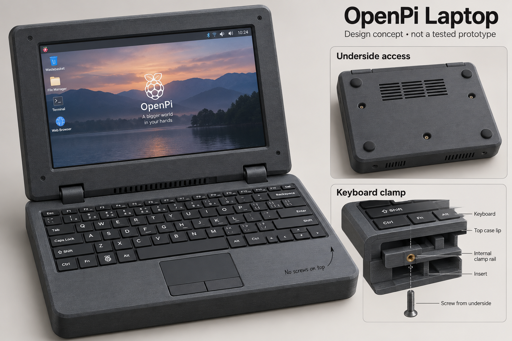
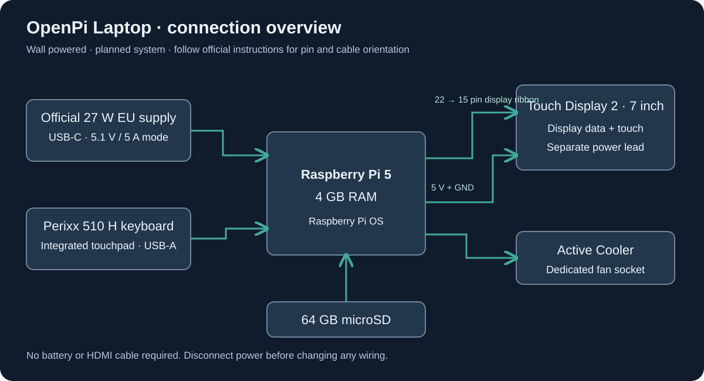

# OpenPi Laptop

A repairable Raspberry Pi mini laptop with a 3D-printed enclosure, a 7-inch touchscreen, and a built-in keyboard with a touchpad. The keyboard stays firmly in place during use; its fasteners are accessible from the underside only.

**Status: enclosure prototype design v0.2, with CAD, STEP and STL files. No physical build or fit tests yet. Funding is not approved, and the parts budget still exceeds S tier.** The image above is an AI appearance concept. The actual CAD below is the current mechanical design.

[Stardance project](https://stardance.hackclub.com/projects/61671) · [Parts list](BOM.csv) · [Budget](docs/budget.md) · [CAD](CAD/README.md) · [Build guide](docs/build-guide.md)

## Why build it?

I want to learn how a computer becomes a complete device: choosing compatible parts, designing an enclosure, managing cables and cooling, assembling it, and checking that it works. OpenPi is intended for learning Linux, writing small programs, and lightweight everyday computing.

The original work is the enclosure and component integration: underside keyboard retention, cable routing, ventilation, and a serviceable assembly. The computer, display, and keyboard are purchased modules. This version does not claim a custom PCB or custom firmware.

## Selected design

| Area | Selection | Reason |
|---|---|---|
| Computer | **Raspberry Pi 5, 4 GB RAM** | Requested platform |
| Storage | **SanDisk Ultra 64 GB**, A1, Class 10 microSD | Operating system and project storage |
| Display | **Raspberry Pi Touch Display 2, 7 inch** | Official DSI display; landscape desktop target 1280 × 720 |
| Keyboard | **Perixx PERIBOARD-510 H / H PLUS**, wired USB-A; English US preferred | Compact keyboard with integrated touchpad; confirm exact variant |
| Power | **Official Raspberry Pi 27 W USB-C EU supply** | Supports 5.1 V / 5 A for Pi 5; cable included |
| Cooling | **Official Active Cooler** | Dedicated Pi 5 fan connector |
| Enclosure | Custom charcoal **PETG**, printed on **QIDI Q2** | Printer already available; filament budgeted separately |
| Keyboard mounting | Padded internal retainers, screws accessed **only from below** | No magnets or tool-free removal |
| Lid | Two integral printed hinges, M4 axes, friction washers, 110° stops | Designed in CAD; holding force and cable routing require physical testing |
| Battery | None in version 1 | Runs while connected to wall power |

The keyboard remains an intact USB product. Do not drill its electronics or shorten its factory cable. Reserve space for the long cable and its connector. Extra keyboard USB ports are not required for this design.

## How it works

The supply connects directly to the Pi's USB-C power port. The microSD holds Raspberry Pi OS. The keyboard connects to USB-A, and the cooler uses the dedicated fan socket.

The display needs **two connections**: a Pi 5 compatible display ribbon for data and its power lead connected to the documented 5 V/GND pins. Follow the [official display instructions](https://www.raspberrypi.com/documentation/accessories/touch-display-2.html) for connector orientation and pin identification. This overview is not a pin-level assembly drawing.

The included display cable is suitable for bench testing. The final hinged layout may require a longer **display-specific** ribbon; do not substitute a camera ribbon just because it looks similar. Length, orientation, strain relief, and repeated bending remain to be checked. This display does not require HDMI.

## Enclosure v0.2

The enclosure body is **262 × 250 mm**. Including hinges, the base is **262 × 262 × 51.5 mm**, and the lid back is **262 × 266 × 35.5 mm**. These are individual print envelopes. The QIDI Q2's nominal print volume accommodates them, but the lid leaves little room for a brim. Check the slicer before printing.

The layout reserves a **230 × 160 mm** keyboard area at the front and a rear electronics bay. The supplier lists inconsistent keyboard heights; the model provisionally reserves **26 mm**. This is not a measured fit. A top lip contacts the outer keyboard housing, while padded supports retain it from underneath. Fasteners engage internal retainers, never the keyboard circuit board.

The [current CAD](CAD/README.md) includes the base, upper keyboard deck, two underside support rails, lid back, display bezel, integral hinges, opening stops, ventilation, service openings and fastener pockets. Six main printable parts and two hinge test coupons are exported. **Print the hinge coupons first; measure the actual keyboard rim, display and connectors before committing to the full case.**

The model has valid single solids and closed STL meshes. The printed lid clears the printed base at eleven sampled angles from 0° to 110°; the stop engages in the 112° check. This verifies nominal geometry, not physical strength, continuous motion, cable life or fit of parts that have not been measured.

## Download the 3D parts

STL files are for the slicer; STEP files are for exchanging the 3D design; FCStd files open in FreeCAD. The model is a prototype, not a physically validated product. Keyboard and screen shapes in the assembly are reference envelopes.

| File | Purpose |
|---|---|
| [Open assembly — FCStd](CAD/v0.2/openpi-assembly.FCStd) | View the complete assembly in FreeCAD |
| [Assembly — STEP](CAD/v0.2/openpi-assembly.step) | Open the assembly in another CAD tool |
| [Individual parts — FCStd](CAD/v0.2/openpi-parts.FCStd) | Inspect individual parts |
| [Individual parts — STEP](CAD/v0.2/openpi-parts.step) | Neutral part export |
| [Base STL](CAD/v0.2/STL/base.stl) | Bottom shell and fixed hinge forks |
| [Keyboard deck STL](CAD/v0.2/STL/keyboard_deck.stl) | Upper frame and support posts |
| [Left rail STL](CAD/v0.2/STL/keyboard_rail_left.stl) | Left underside keyboard support |
| [Right rail STL](CAD/v0.2/STL/keyboard_rail_right.stl) | Right underside keyboard support |
| [Lid back STL](CAD/v0.2/STL/lid_back.stl) | Display cradle and moving hinges |
| [Display bezel STL](CAD/v0.2/STL/display_bezel.stl) | Front display frame |
| [Fixed hinge coupon STL](CAD/v0.2/STL/hinge_fixed_coupon.stl) | Small test piece — print first |
| [Moving hinge coupon STL](CAD/v0.2/STL/hinge_moving_coupon.stl) | Matching small test piece — print first |

Print one of each main part after successful fit checks. The assembly is shown open at 110°. Closed height is nominally 73 mm before feet; the main body is 262 × 250 mm. Each STL has its own origin, so importing all STLs together does not automatically assemble them. The editable generator is [build_enclosure.py](CAD/build_enclosure.py); the results are in [checks.json](CAD/v0.2/checks.json).

## Exact screws and mounting hardware

Use metric machine screws with socket heads, **ISO 4762 / DIN 912**, preferably stainless A2. Length is measured **under the head**. The list is specific to enclosure **v0.2**.

| Screw | Quantity used | Where it goes |
|---|---:|---|
| **M3 × 12 mm**, pitch 0.5 mm | **12** | Six base/deck joints and six lid/bezel joints |
| **M3 × 8 mm**, pitch 0.5 mm | **4** | Keyboard support rails; access only from below |
| **M4 × 45 mm**, pitch 0.7 mm | **2** | Metal hinge axes |
| **M2.5 × 6 mm**, pitch 0.45 mm | **4** | Bottom screws for the Pi spacers |
| **M2.5 × 5 mm**, pitch 0.45 mm | **4** | Pi board to spacers |

Also needed:

- **16 × M3 DIN 934 nuts**, 5.5 mm across flats, nominal 2.4 mm thick.
- **2 × M4 DIN 985 nylon-insert locknuts**, 7 mm across flats, nominal 5 mm high.
- **16 × M3 flat washers**, 3.2 × 7 × 0.5 mm (inside diameter × outside diameter × thickness).
- **4 × M4 steel flat washers**, 4.3 × 9 × 0.8 mm.
- **4 × fibre friction washers**, 4.3 × 10 × 0.5 mm, between hinge knuckles.
- **8 × M2.5 nylon washers**, 2.7 × 6 × 0.5 mm.
- **4 × M2.5 female–female nylon spacers, 6 mm long**, continuous through-thread, maximum 5 mm across flats.
- Keyboard edge pads (nominal 1 mm), measured display support pads, cable strain relief and four feet at least 4 mm thick.

This totals **26 screws, 18 nuts, 32 washers and 4 spacers**. Optional spares: two of each screw size and two extra M3 nuts/washers. The cooler uses its supplied mounting hardware. No screw is driven into the keyboard or display electronics.

The [assembly guide](CAD/v0.2/ASSEMBLY.md) gives the screw-length calculations, washer order, nut locations, print orientation, and step-by-step assembly. Hinge order: screw → steel washer → fixed knuckle → fibre washer → moving knuckle → fibre washer → fixed knuckle → steel washer → locknut. Do not replace the M4 × 45 with a 40 mm screw.

## Budget and S-tier funding

**Result: the selected new-parts build does not fit the S-tier allowance. This is a transparent planning estimate, not a funding-ready shopping cart.** No order has been placed and no personal contribution is assumed.

### Cost summary

| Group | EUR |
|---|---:|
| Raspberry Pi 5, 4 GB | 129.90 |
| Official 7-inch Touch Display 2 | 64.50 |
| Perixx keyboard with touchpad, reference variant | 39.99 |
| SanDisk Ultra 64 GB | 19.90 |
| Official 27 W supply, cable included | 12.40 |
| Official Active Cooler | 5.90 |
| **Electronics subtotal** | **272.59** |
| PETG, full 1 kg spool allowance | 25.00 |
| v0.2 fasteners, hinge axes, washers and standoffs allowance | 20.00 |
| Integral printed hinges | 0.00 extra; included in filament |
| Additional display cable/power lead allowance | 10.00 |
| Pads, feet, and strain relief allowance | 4.00 |
| USB microSD reader allowance | 5.00 |
| Shipping and destination-tax adjustment allowance | 20.00 |
| Contingency | 15.00 |
| **Planning total** | **371.59** |

The [ECB reference rate for 11 September 2026](https://www.ecb.europa.eu/stats/policy_and_exchange_rates/euro_reference_exchange_rates/html/index.en.html) was **1 EUR = 1.1592 USD**. On that reference basis:

- EUR 371.59 × 1.1592 = **USD 430.75**.
- The [S-tier cap of USD 200](https://stardance.hackclub.com/resources/tiers) corresponds to approximately **EUR 172.53**.
- Estimated gap: **USD 230.75**, or about **EUR 199.06**. Actual payment conversion and fees may differ.

Even the Pi and selected display alone total **EUR 194.40**, approximately **USD 225.35**, before storage, input, power, printing, or delivery. This rules out funding this exact all-new selection solely with USD 200 at these quotes. It does not prove that no cheaper used-parts design could exist.

### Price evidence and limitations

| Item | Evidence | Qualification |
|---|---|---|
| Pi 5 / 4 GB | [Elecom](https://www.elecom.sk/raspberry-pi-5-4-gb-2/): EUR 129.90 | Retail reference, not a locked delivered quote |
| Cheaper Pi listing checked | [BerryBase](https://www.berrybase.de/raspberry-pi-5-4gb-ram): EUR 118.50 | Unavailable when checked; excluded from purchase estimate |
| Display | [BerryBase](https://www.berrybase.de/raspberry-pi-touch-display-2?c=320): EUR 64.50 | 7-inch model, stock shown when checked |
| Keyboard | [Perixx](https://eu.perixx.com/products/periboard-510h): EUR 39.99 | Page selected Spanish; English US is the desired variant, with its price/stock still to confirm |
| Card | [BerryBase microSD listing](https://www.berrybase.de/multimedia-office/speicherkarten-usb-sticks/microsd-karten): EUR 19.90 | SanDisk Ultra 64 GB, EAN 619659200541 |
| Supply | [BerryBase](https://www.berrybase.de/detail/019234a5bfb57193899acec14a1eebd6): EUR 12.40 | Official 27 W EU model; cable included |
| Cooler | [BerryBase](https://www.berrybase.de/raspberry-pi-active-cooler-luefter-fuer-raspberry-pi-5): EUR 5.90 | Official Pi 5 Active Cooler |

Displayed prices include the seller's stated VAT. Delivery to Slovakia, destination VAT, availability, keyboard variants, and payment fees must be rechecked at checkout. The estimate is not a claim to be the cheapest possible selection. Small hardware and material amounts are explicitly **allowances**, not sourced offers.

The additional ribbon allowance is separate from the display's included bench cable. There is no separate HDMI cable, USB-C cable, battery, mouse, or paid operating system in this budget. Only the printer is confirmed owned. A computer for card writing and basic tools must be available or borrowed; purchasing tools is not covered by this estimate.

Enclosure revision v0.2 replaces bought hinges with integral printed hinges and two M4 axes. The former EUR 8 fastener and EUR 12 hinge allowances are combined into a EUR 20 hardware allowance; the total estimate is unchanged. Exact installed fasteners are listed in README and CAD/v0.2/ASSEMBLY.md. This is not a verified hardware-kit price, and optional spares are not included. Recheck filament usage after slicing the larger enclosure.

### What would make USD 200 feasible?

This remains an unresolved procurement/design task. It requires confirmed lower delivered prices or supplied components, and probably a cheaper display and input arrangement. Used or donated parts must be genuinely available and acceptable under the funding rules; none are assumed here. Replacing the display or keyboard also requires updating the enclosure, wiring, and tests.

The requested Pi 5 **4 GB** and **64 GB** storage have been preserved. Silently substituting a Pi 4, a 2 GB board, or a 32 GB card would not meet the stated requirements. Simply labeling a larger bill “S tier” also does not solve the shortfall. A higher tier requires the corresponding project merit and review, not merely a higher price.

Before submission, replace every allowance with an actual part/quantity and delivered quote, resolve the keyboard variant, verify the total in USD including fees, and document how any remaining difference is funded. No extra spending by the family is authorized or presumed.

## Milestones

| Stage | Required result | Status |
|---|---|---|
| Requirements | Pi 5 / 4 GB, 64 GB card, touchpad, underside screws | Documented |
| Concept | Appearance, connection diagram, component layout | Prepared; untested |
| Parts and budget | Affordable delivered quotes and exact keyboard variant | Open |
| Enclosure CAD | Mounts, service openings, fasteners, hinges and stops; STEP/STL | v0.2 exported; physical fit and cable checks pending |
| Funding review | Complete design and accurate BOM submitted | Not submitted |
| Electronics | OS boots; input, display, cooling, and power checked | Not built |
| Enclosure | Fit coupons, revisions, and assembly | Not printed |
| Validation | Real photos, recorded results, working demo | Not tested |

Design submission precedes funding; physical construction follows obtaining components. Tests that cannot be performed before funding must be disclosed, not replaced by invented results.

## Full build and test procedure

<!-- consolidated-guides-v02 -->
The complete instructions are included below, so you do not need to open another guide to follow the build. Start with the small hinge coupons and verify actual component dimensions before a full print.

These steps describe future work. The prototype has not been built. Finish the detailed design and resolve the budget before ordering.

### 1. Finish the design

1. Confirm Pi 5 **4 GB**, **64 GB** card, and the exact keyboard variant. Resolve conflicting keyboard heights with the supplier and record its cable exit and outer edge dimensions.
2. Use the designed v0.2 printed hinges and M4 axes described in [the enclosure assembly guide](CAD/v0.2/ASSEMBLY.md). Test the small hinge coupons before the full print; holding friction and strength remain unmeasured.
3. Complete mounts from manufacturer drawings, port openings, ventilation, and cable routing. Use cardboard envelopes when real parts are unavailable.
4. Check the v0.2 underside rails, pads, tightening stops and 2 mm retaining lip against the exact keyboard housing. Adjust support height if the physical rim differs from the assumed envelope.
5. Follow the exact screw list and nominal engagement calculations in the enclosure assembly guide. Verify printed clearances and actual hardware before tightening. Keep metal clear of electronics.
6. Confirm delivered prices and obtain funding review before purchasing on the assumption of reimbursement.

### 2. Prepare after parts arrive

1. Work on a clear table, with the power supply unplugged. Gather the parts, small screwdriver, ruler/calipers, and a computer with a microSD reader. Borrow tools if possible; only the printer is confirmed owned.
2. Photograph and measure each part. Compare it with the CAD and revise any differences before printing.
3. Follow the [official Touch Display 2 instructions](https://www.raspberrypi.com/documentation/accessories/touch-display-2.html) for pin identification and ribbon orientation. Ask an adult to check the first power-lead connection with you.

### 3. Bench test

1. Get Raspberry Pi Imager from the [official software page](https://www.raspberrypi.com/software/). Select Pi 5, the current Raspberry Pi OS desktop image, and the 64 GB microSD. Writing erases the selected card; check the destination carefully. Keep passwords out of recordings.
2. Let writing and verification finish. Eject the card and insert it into the Pi.
3. Install the Active Cooler with its supplied pads and fasteners. Connect it to the Pi's dedicated fan socket.
4. With power disconnected, fit the supplied Pi 5 compatible display cable exactly as the manufacturer shows. Open and close the latches gently; never force a ribbon.
5. Attach the display power lead to the documented 5 V/GND pins. Verify polarity before powering anything.
6. Plug the intact keyboard into USB-A. Support the board and display on stable nonconductive surfaces.
7. Connect the official USB-C supply last. Complete first boot and OS setup.
8. Use the desktop display settings to select landscape orientation and check that touch coordinates match. Labels depend on the OS version.
9. Type a sentence; test every key, pointer movement, left/right click, and scrolling. Optional gestures require real Linux testing.
10. Shut down through the desktop and wait for completion before unplugging or changing wiring.

### 4. Print and assemble

1. Print small test pieces for keyboard retention, nut capture, hinges, and fit clearances. Adjust the design from measured results.
2. Start with the filament manufacturer's PETG settings and the QIDI material profile. Slice each revised shell individually; check supports, brim, print volume, and material use.
3. Remove sharp edges and debris. Test fasteners in empty printed parts before installing electronics.
4. Mount the Pi on insulating supports using suitable M2.5 hardware. No screw or case surface may contact underside electronics.
5. Seat the intact keyboard against the upper retaining lip. Install padded internal supports and tighten the underside-accessed screws evenly to their designed stops. Do not drill or screw into the keyboard.
6. Route the full keyboard cable in loose loops, away from the fan and hinge. Do not cut or sharply fold it.
7. Mount the display using its intended fixing points; do not clamp the active glass. Check allowed screw engagement before tightening.
8. Install the final hinges, stops, and strain relief. Leave an adequate service loop for the display ribbon and power lead. Ordinary FFC is not automatically suitable for repeated hinge movement.
9. With power off, move the lid slowly through its range. Resolve pinches and contact before continuing.
10. Close the base from below. Keep feet and fasteners clear of vents and verify access to power and external ports.
11. Repeat the bench tests in the enclosure. Record results below.

### 5. Test record

Project targets below are not manufacturer guarantees. Add date, setup, evidence, and actual results after each test.

| Check | Planned pass condition | Result |
|---|---|---|
| Startup | Five consecutive boots to desktop without storage errors | Not tested |
| Keyboard | Keys and modifiers work; NumLock behavior documented | Not tested |
| Touchpad | Pointer, clicks, and supported scrolling work | Not tested |
| Display | Readable landscape picture and matching touch coordinates | Not tested |
| Power | No undervoltage warning under normal use and sustained load | Not tested |
| Cooling | Log ambient/CPU temperatures over 30 minutes of load; target CPU below 80°C and no throttling | Not tested |
| Retention | No keyboard rocking or lift while typing normally | Not tested |
| Lid | 50 slow cycles without pinching, dropout, or loosening; initial check only, not a lifetime rating | Not tested |
| Closed fit | Keys and display do not touch; lid rests on stops | Not tested |
| Service | Components accessible without destructive disassembly | Not tested |

### 6. Record the finished build

1. Update the BOM with actual quantities and paid prices.
2. Export final editable CAD, STEP, and tested printable STL files.
3. Add real inside/outside photos and a demo showing boot, typing, touchpad use, and enclosure details.
4. Record failures and fixes, not just successes. Keep real photos separate from the AI concept.
5. Follow the current Stardance submission prompts. S tier remains a reviewer decision.

## Detailed mechanical assembly

### Screw-length checks built into the design

| Joint | Designed stack and tip clearance |
|---|---|
| Base/deck M3 × 12 | Driver-well shoulder z=30.5; 0.5 mm washer places under-head plane z=30. Tip z=42. Nut seated at z=39.2–41.6; blind bore ends z=42.5; deck top z=43. |
| Lid/bezel M3 × 12 | Shoulder z=13.5; washer gives under-head plane z=13. Tip z=25. Nut z=22.2–24.6; bore ends z=26; front z=27. |
| Keyboard M3 × 8 | Rail bottom z=9; washer gives under-head plane z=8.5. Tip z=16.5. Nut z=12.2–14.6; bore ends z=17.5. Screw axes lie outside the keyboard envelope. |
| Pi M2.5 × 6 and × 5 | Bottom screw engages 2.5 mm above the floor. Top screw engages about 2.9 mm assuming 1.6 mm PCB + 0.5 mm washer. Opposing tips have nominal 0.6 mm clearance. Verify actual thickness and spacer thread before tightening. |
| Hinge M4 × 45 | 36 mm knuckle/inner-washer stack + 1.6 mm outer washers + 5 mm nut = 42.6 mm. A 45 mm screw projects nominally 2.4 mm beyond the nut. Confirm the thread reaches the nylon ring; do not replace with a 40 mm screw. |

These are nominal geometric stacks, not manufacturing-tolerance guarantees. Nut-pocket AF is 5.8 mm; M3 clearance bores are 3.4 mm; hinge bores are 4.4 mm; driver wells are 8.2 mm. Printed holes may need careful deburring. If a screw bottoms before clamping, stop and correct the fit.

### Keyboard retention

1. Print the deck and rails only after measuring the exact keyboard's plastic rim, keys, and cable exit. The current envelope is 230 × 160 × 26 mm, positioned x=16–246, y=14–174, z=13–39. The top opening is 226 × 156 mm and assumes a usable 2 mm peripheral housing lip. Confirm that this lip does not cover keys or touchpad controls.
2. Fit the four M3 nuts into the underside post pockets. Fit the six shell-joint nuts into the underside deck pockets. A small piece of tape can temporarily retain nuts; keep adhesive off threads.
3. Insert the intact keyboard from below. Attach 1 mm soft pad strips only under its sturdy outer housing edges, above the two rails. Keep pads clear of electronics and moving controls.
4. Attach the two rails using four M3 × 8 screws and washers. The rails touch post shoulders at z=12: this is a hard tightening stop. Tighten gently until seated, never until the keyboard housing bends.
5. A thinner keyboard needs measured rigid shims under its rim, not extreme screw tightening or a large soft foam stack. The manufacturer lists conflicting heights; update the support height in the CAD after measuring the rim. Keycap height alone is not sufficient.
6. With the base installed, the four rail screws remain accessible through underside driver holes. Removing the keyboard requires undoing the base/deck fasteners and rails, then withdrawing it from below. It does not lift out from the top.

### Pi and cable assembly

1. With power disconnected, install four 6 mm nylon spacers using the four M2.5 × 6 floor screws and nylon washers.
2. Place the Pi on the spacers, USB/Ethernet edge toward the left service opening, USB-C edge toward the rear opening. Use the four M2.5 × 5 top screws and nylon washers. Stop if the washer contacts a component rather than the board's mounting land.
3. The hole pitch is 58 × 49 mm, based on the [Pi 5 reference drawing](https://datasheets.raspberrypi.com/rpi5/raspberry-pi-5-mechanical-drawing.pdf). The manufacturer itself requires physical-component verification before production. The cooler and all plugged-in cable envelopes still need a physical clearance check.
4. Loop the intact keyboard USB cable in the rear-right bay and restrain it away from the fan. The generous service openings are intentional prototype features; verify plug insertion before refining them.
5. Route the display-specific ribbon and power lead through the central rear openings in both shells. Use soft edge protection and strain relief, leaving a service loop. Cables are not included in the rigid-body collision simulation.

### Lid and hinges

1. Test the **fixed and moving hinge coupons** first with one M4 × 45 screw, two outer steel washers, two inner fibre washers, and one M4 locknut. These coupons reproduce the real geometry.
2. Install display support pads against sturdy rear structural surfaces, avoiding electronics and ribbon connectors. The nominal stack allows 3 mm below a 15 mm module and 1 mm of soft padding at its outer front border. Confirm the physical module and its connector protrusions before closing the lid.
3. The bezel opening is 157.5 × 90 mm, larger than the documented viewing area. Centering is assumed; check the actual active-area location. Never load the active glass or force a bowed panel into position.
4. Fit six M3 nuts to bezel pockets. Attach bezel to lid back with six M3 × 12 screws and washers from the rear. Printed columns limit closure; the padding should retain the display without bending it. Change pad thickness or CAD if the module stack differs.
5. Assemble each hinge along the axis in this order: **M4 screw head → steel washer → fixed knuckle → fibre washer → moving knuckle → fibre washer → fixed knuckle → steel washer → M4 locknut**.
6. Tighten the locknut only enough to remove play and obtain modest friction. The printed stops meet at 110 degrees. Do not force the lid beyond the stop. PETG may creep under sustained clamp load; holding torque and durability require real tests. No numerical tightening torque is claimed.
7. Attach the deck/base with six M3 × 12 screws and washers through the deep underside wells. Apply four feet at least 4 mm thick so the Pi floor screw heads clear the table; keep feet away from vents.
8. Slowly open and close the unpowered lid while watching the cables. Then test the electronics and record results using the build guide. The 110-degree stop is not proof of cable suitability or long-term strength.

### Printing order

1. Print the two hinge coupons first, using PETG, and check the 4.4 mm axis bore and 0.5 mm washer gaps.
2. Check nut capture, rail fit, keyboard lip, display thickness, and the actual board against the design before printing all six large parts. Make local test cuts of those regions in the slicer if needed.
3. Base: floor on bed; use local supports for hinge overhangs, with access for removal. Lid back: outer back on bed; support hinge overhangs. Deck: rotate so its flat top is on the bed and posts grow upward. Bezel: front face on bed. Rails: broad face on bed.
4. Start with a calibrated PETG profile, 0.2 mm layers and at least four perimeters; use solid local infill around hinge roots. These are starting settings, not a strength certification. Inspect layer bonding and hinge-axis alignment on the coupons.
5. Check slicer bounds before adding a brim. The lid is 266 mm deep and does not allow a wide brim on a 270 mm bed.

### Automated checks completed

Six main parts exported as valid single solids and closed STL meshes. Bounding boxes fit the nominal printer volume. Named static printed parts and the simplified Pi/keyboard envelopes do not intersect. The rigid printed lid has no detected intersection at the eleven sampled positions from 0 to 110 degrees; a 112-degree check contacts the stop. The test samples angles; it is not a continuous-motion or finite-element analysis. Physical assembly, clamp pressure, cable movement, thermals, and hinge life remain untested.

## Stardance progress and submission

1. Record your actual project work using the recording tools accepted by Stardance. Check that recording is running, and pause during breaks.
2. Save the session before closing the recorder. Post an honest devlog: what you changed, what you learned, what failed, and your next step. Add the relevant progress images and recording according to the form.
3. Keep the README, BOM, CAD and images together in this repository so relative links work. Do not present the AI concept as a prototype photograph or report unperformed tests as passed.
4. Before requesting funding, resolve the budget gap, confirm exact component fit and cable routing, and complete the project information requested by Stardance.
5. Submit the design for funding review using the current project form. S-tier classification and funding are not automatic. No grant has been approved for this project.
6. After obtaining components, build and test the prototype, publish real photographs and a working demo, and update actual costs and test results before the final project submission.

Follow the [official hardware guide](https://stardance.hackclub.com/resources/hardware) and [shipping guide](https://stardance.hackclub.com/resources/shipping-hardware) for current requirements. A devlog is a short progress report; a BOM is a parts list; CAD is the 3D design.

## Files

- [BOM.csv](BOM.csv): quantities, prices, allowances, and supplier links.
- [CAD](CAD/README.md): v0.2 enclosure, STEP, STL, assembly instructions and checks.
- [Build guide](docs/build-guide.md): assembly sequence and planned tests.
- [Budget](docs/budget.md): dated costs and funding gap.
- [Slovak next steps](docs/next-steps-sk.md): instructions for a beginner.
- [Image provenance](docs/image-generation.md): generation mode and prompt.

## References and assistance

- [Raspberry Pi 5](https://www.raspberrypi.com/products/raspberry-pi-5/)
- [Official power supply](https://www.raspberrypi.com/products/27w-power-supply/)
- [Active Cooler](https://www.raspberrypi.com/products/active-cooler/)
- [Perixx keyboard](https://eu.perixx.com/products/periboard-510h)
- [QIDI Q2](https://qidi3d.com/pages/qidi-q2)
- [Stardance hardware guide](https://stardance.hackclub.com/resources/hardware)

AI assistance was used for documentation, the appearance illustration, and CAD generation. The v0.2 preview is rendered from the real CAD mesh, not generated as an appearance illustration. Physical measurements, construction, and testing remain separate work. No physical build or grant approval is implied.
